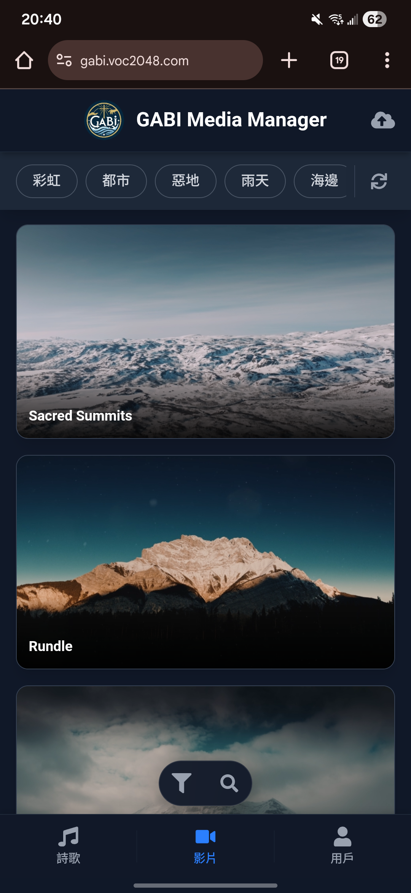
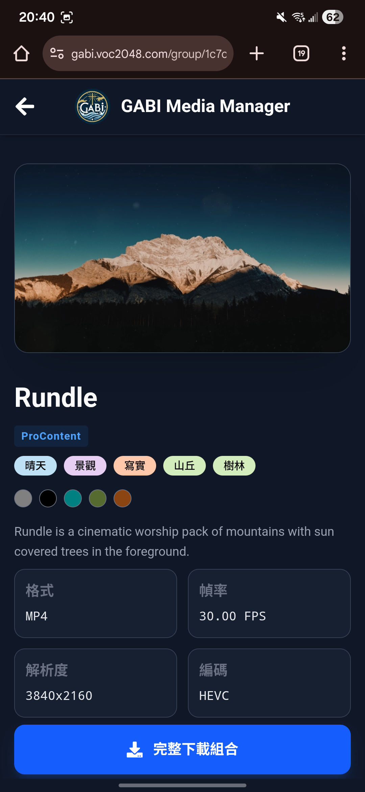
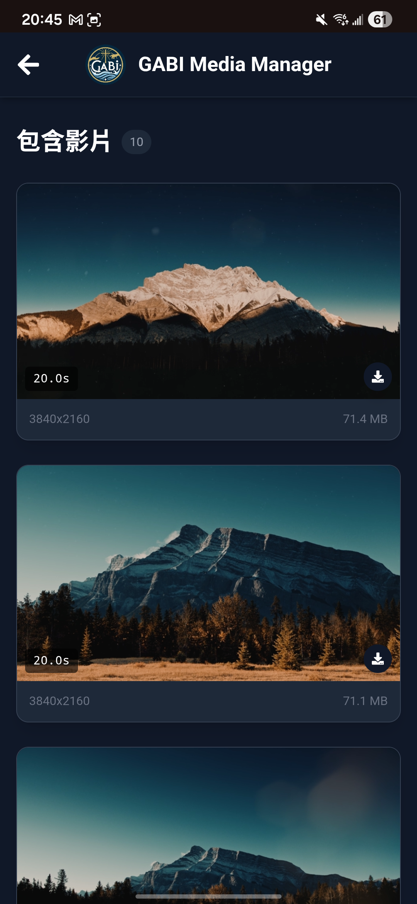
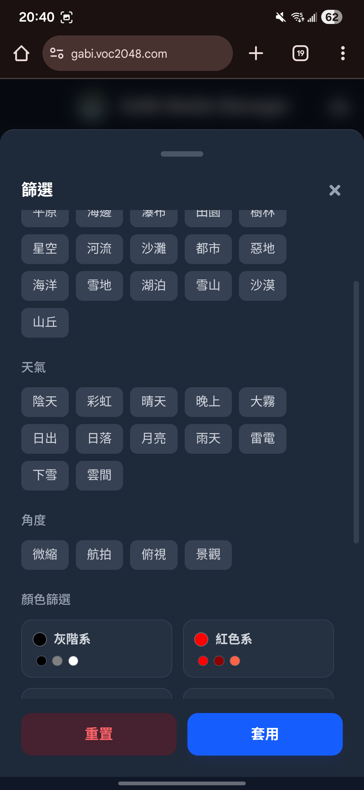
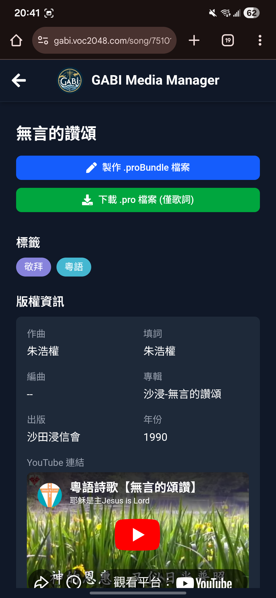
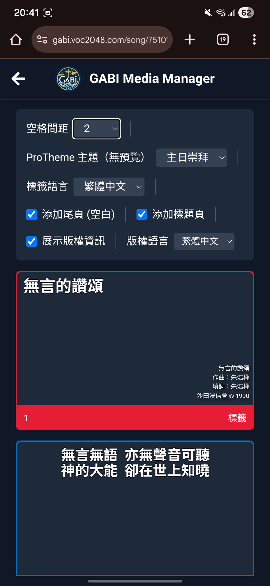

# GABI-Media-Manager

> GABI 的 ProContent 影片、詩歌管理工具，用於簡化投影員選擇背景影片及製作ProPresenter相關詩歌檔案的流程。

### Tech Stack
 

## 圖片集

> 聲明：截圖中部份影片來源自ProContent，於許可生效期間下載，僅供教會內部使用，並未附帶於本repo內

> 聲明：截圖中的詩歌版權屬各出版者，部份歌詞、詩歌來源等資訊來自網上，僅供教會內部使用，歌詞並未附帶於本repo內

| 頁面| 手機端  | PC端                                                       |
| --------------- | ------------------ | ------------ |
| 主頁/影片列表頁 |                                                                           |  |
| 影片詳情頁      |   |       |
| 搜尋功能        |                                                                           |       |
| 詩歌列表頁      |                                                                           |       |
| 詩歌詳情頁      |   |       |

## 部署說明

### 使用 Docker Compose 部署

1. **準備檔案**：
   - 複製 `docker-compose.yml.example` 為 `docker-compose.yml`，並根據需要修改環境變數。
   - 在 `backend/cert` 中儲存你的 `cert.pem`, `key.pem` (如需要)
   - 複製 `frontend_react/nginx.conf.example` 為 `frontend_react/nginx.conf`，並設定 SSL 證書路徑和域名。
   - 從 [ProPresenter7-Proto](https://github.com/greyshirtguy/ProPresenter7-Proto/tree/master/Proto%2019beta) 中下載v19版本的proto檔案，並複製到 `backend/proto`

2. **設定環境變數**：
   - 在 `docker-compose.yml` 中調整以下變數：
     - `PORT`: 後端服務端口（預設 3000）。
     - `NODE_ENV`: 環境模式（production）。
     - `NODE_ISLOCAL`: 是否為本地環境（true）。
     - `VIDEO_DIR`, `THUMB_DIR`, `TEMP_DIR`, `AVATAR_DIR`: 媒體檔案目錄路徑。
     - `DS_SALT`: 用於資料加密的鹽值（請自行更換）。
     - `DB_BACKUP_MAIN`, `DB_BACKUP_SUB`: 資料庫備份目錄。
     - `VALID_VIDEO_EXTENSIONS`: 支援的影片副檔名。
     - `INVITATION_CODE`: 用戶邀請碼。
     - `FRONTEND_ORIGIN`: 允許的前端來源 URL（多個以逗號分隔）。
     - `BACKEND_USE_HTTPS`: 是否啟用 HTTPS（true/false）。
     - `VITE_API_BASE_URL`: 前端 API 基礎 URL。

3. **設定 Nginx**：
   - 在 `frontend_react/nginx.conf` 中：
     - `server_name`: 設定域名（如 your.domain.com）。
     - `ssl_certificate`, `ssl_certificate_key`: SSL 證書檔案路徑（根據你的檔案名字修改就好）。
     - `proxy_pass`: 代理到後端服務（如 http://backend:3000/api/）。

4. **運行部署**：
   - 確保 Docker 和 Docker Compose 已安裝（亦可以直接使用Docker Desktop）。
   - 在專案根目錄執行：`docker-compose up --build`。
   - 應用程式將在指定端口運行（後端 3000，前端 443）。

5. **注意事項**：
   - 確保掛載的磁碟區路徑存在，如果是透過SMB連接的話，需要在每次重新啟動主機後手動觸發連線。
   - 若使用 HTTPS，需提供有效的 SSL 證書。
   - 建議預留最少2GB空間用於存放暫存檔案

## 語言翻譯

- 所有有關翻譯的字詞都在 `frontend_react/src/lang`
- 若要添加/修改翻譯語言，可以自行新增檔案，並在 `translations.js` 手動添加在映射表
- 詩歌標籤，影片標籤則在資料庫內

## 資料庫結構

### video_data (影片資料表)

| 欄位名稱         | 資料型態 | 說明                              |
| ---------------- | -------- | --------------------------------- |
| video_id         | INTEGER  | 主鍵，自動遞增                    |
| group_id         | INTEGER  | 影片所屬群組ID                    |
| video_filename   | TEXT     | 影片檔案名稱                      |
| video_resolution | TEXT     | 影片解析度                        |
| video_format     | TEXT     | 影片格式 (E.g. MP4, WAV)          |
| video_duration   | FLOAT    | 影片長度（秒）                    |
| video_filesize   | INTEGER  | 影片檔案大小（位元組）            |
| video_frame_rate | FLOAT    | 影片幀率 (E.g. 59.97fps, 60fps)   |
| video_codec      | TEXT     | 影片編碼格式 (E.g. H.264, ProRes) |

### video_group_data (影片群組資料表)

| 欄位名稱         | 資料型態 | 說明                           |
| ---------------- | -------- | ------------------------------ |
| group_id         | INTEGER  | 主鍵，自動遞增                 |
| group_title      | TEXT     | 影片群組標題                   |
| group_desc       | TEXT     | 影片群組描述                   |
| group_author     | TEXT     | 影片群組作者 (E.g. ProContent) |
| group_tags       | TEXT     | 影片群組標籤 (E.g. 100, 131)   |
| group_thumb_name | TEXT     | 影片群組縮圖檔案名稱           |
| group_add_at     | DATE     | 影片群組創建時間               |

### tag_data (標籤資料表)

| 欄位名稱        | 資料型態 | 說明           |
| --------------- | -------- | -------------- |
| tag_id          | INTEGER  | 主鍵，自動遞增 |
| tag_name        | TEXT     | 標籤名稱       |
| tag_locale_name | TEXT     | 標籤本地化名稱 |

### user_data (使用者資料表)

| 欄位名稱      | 資料型態 | 說明                     |
| ------------- | -------- | ------------------------ |
| user_id       | INTEGER  | 主鍵，自動遞增           |
| username      | TEXT     | 使用者帳戶名稱           |
| locale_name   | TEXT     | 使用者顯示名稱           |
| password_hash | TEXT     | 使用者密碼雜湊值         |
| role          | TEXT     | 使用者角色 (ADMIN, USER) |
| last_login_at | DATE     | 最後登入時間             |

### action_record (操作紀錄表)

| 欄位名稱    | 資料型態 | 說明                  |
| ----------- | -------- | --------------------- |
| id          | INTEGER  | 主鍵，自動遞增        |
| user_id     | INTEGER  | 執行操作的使用者ID    |
| action_type | TEXT     | 操作類型 (E.g. LOGIN) |
| action_info | TEXT     | 操作描述              |
| ip_addr     | TEXT     | 使用者IP地址          |
| datetime    | DATE     | 操作時間              |

### song_data (詩歌資料表)

| 欄位名稱       | 資料型態 | 說明                          |
| -------------- | -------- | ----------------------------- |
| song_id        | UUID     | 主鍵，自動生成                |
| song_name      | STRING   | 詩歌名稱                      |
| content        | JSON     | 詩歌內容（預設 []）           |
| song_tags      | STRING   | 詩歌標籤                      |
| song_language  | STRING   | 詩歌語言                      |
| song_copyright | JSON     | 詩歌版權資訊（可空，預設 {}） |
| song_ytlink    | STRING   | YouTube 連結（可空）          |
| uploader_id    | INTEGER  | 上傳者 ID（外鍵到 user_data） |
| createdAt      | DATE     | 創建時間                      |
| updatedAt      | DATE     | 更新時間                      |

### song_tag_data (詩歌標籤資料表)

| 欄位名稱    | 資料型態 | 說明           |
| ----------- | -------- | -------------- |
| tag_id      | INTEGER  | 主鍵，自動遞增 |
| tag_en_name | TEXT     | 標籤英文名稱   |
| tag_zh_name | TEXT     | 標籤中文名稱   |
| tag_type    | TEXT     | 標籤類型       |

### history_data (歷史資料表)

| 欄位名稱    | 資料型態 | 說明                 |
| ----------- | -------- | -------------------- |
| history_id  | INTEGER  | 主鍵，自動遞增       |
| user_id     | INTEGER  | 使用者 ID            |
| group_id    | UUID     | 群組 ID（可空）      |
| video_id    | UUID     | 影片 ID（可空）      |
| action_type | STRING   | 操作類型             |
| created_at  | DATE     | 創建時間（預設 NOW） |
